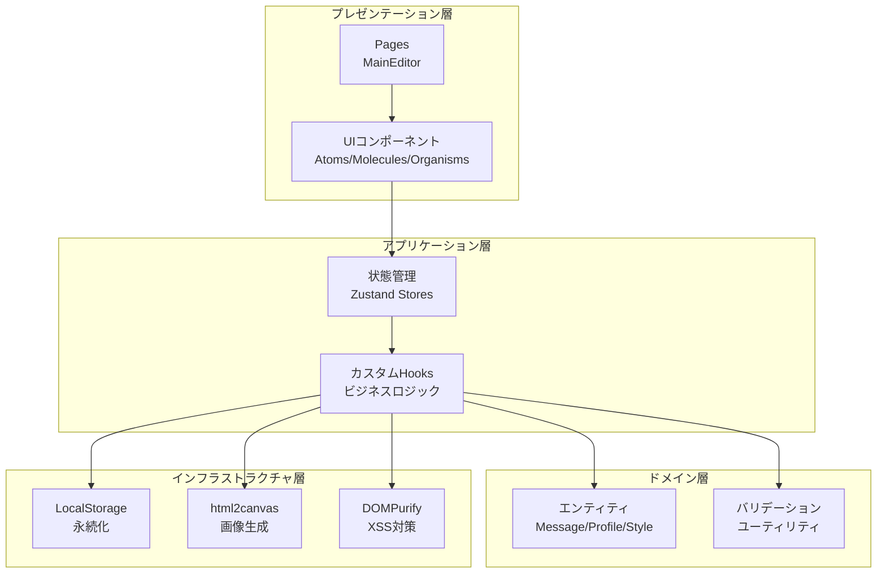
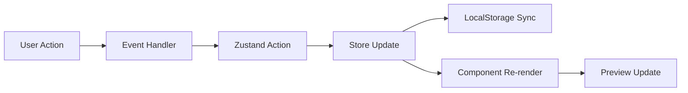
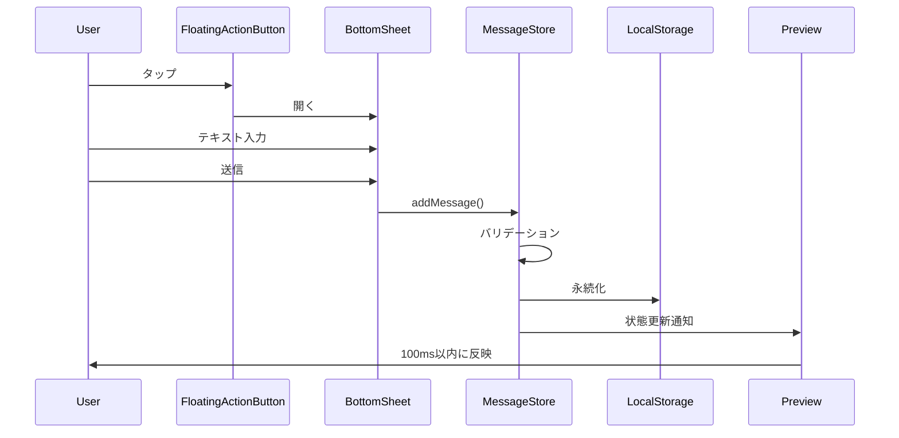
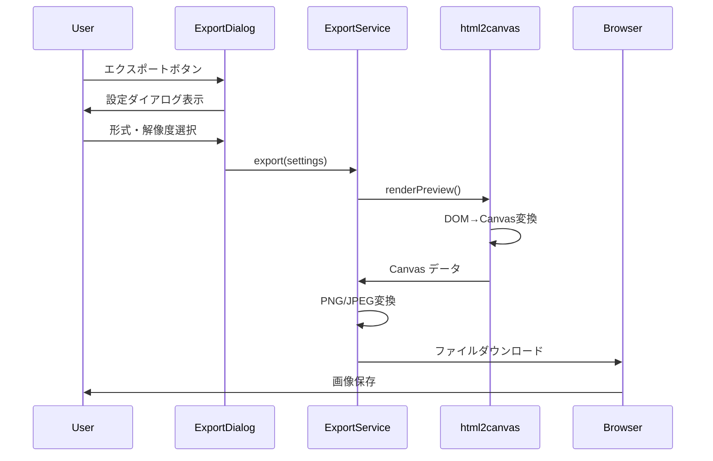
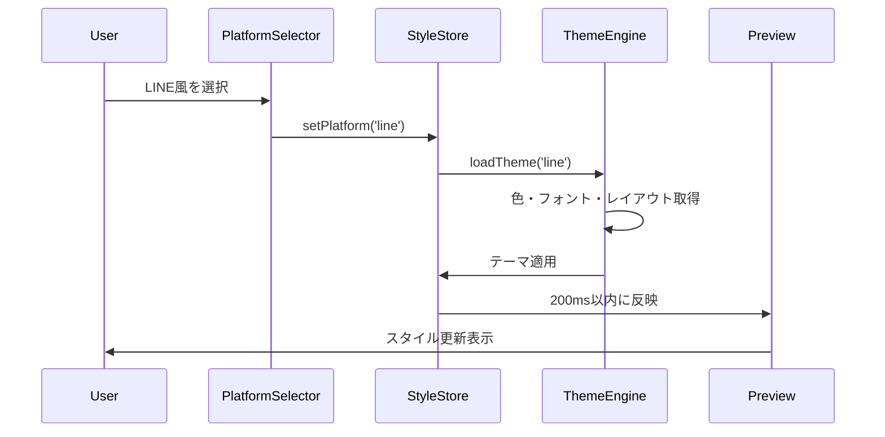
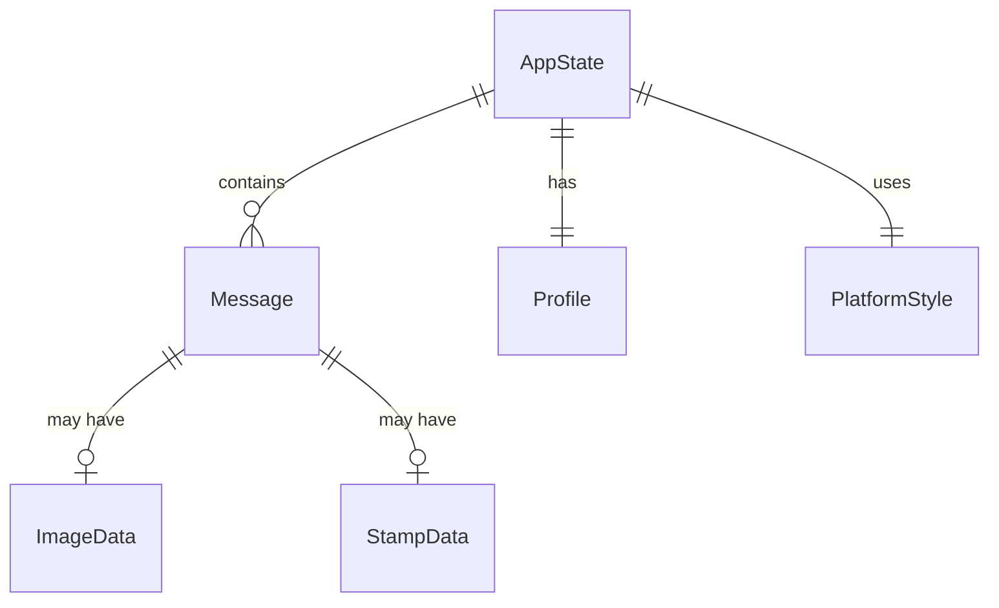
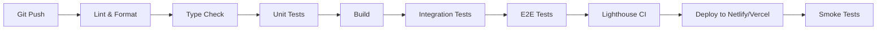

# Technical Design

## Overview

SNS会話履歴作成Webアプリケーションは、完全クライアントサイドで動作するReact + TypeScriptベースのSPA（Single Page Application）です。モバイルファースト設計を採用し、6種類のSNSプラットフォームスタイルを模倣した会話画面を作成し、画像やデータとしてエクスポートする機能を提供します。

**技術的特徴:**
- サーバーレスアーキテクチャ（完全クライアントサイド処理）
- ローカルストレージによる永続化
- リアルタイムプレビュー（100ms応答要件）
- html2canvasによる画像生成
- WCAG 2.1 Level AA準拠のアクセシビリティ

---

## Requirements Mapping

### Design Component Traceability

各設計コンポーネントは特定の要件に対応:

- **MessageStore（状態管理）** → REQ-1: 会話メッセージ管理機能
- **StyleStore（状態管理）** → REQ-2: プラットフォームスタイル選択機能、REQ-4: 外観カスタマイズ機能
- **ProfileStore（状態管理）** → REQ-3: プロフィール設定機能
- **ExportService** → REQ-6: 画像エクスポート機能、REQ-7: データエクスポート機能
- **ImportService** → REQ-8: インポート機能
- **PreviewEngine** → REQ-9: プレビュー機能
- **MessageBubble Component** → REQ-5: 追加コンテンツ機能
- **MobileLayout Component** → REQ-10: モバイルファーストUI要件
- **SecurityService** → REQ-13: セキュリティ要件（XSS対策）

### User Story Coverage

1. **会話作成ストーリー** → MessageList, EditorPanel, BottomSheetコンポーネント
2. **スタイルカスタマイズストーリー** → StyleEditor, PlatformSelectorコンポーネント
3. **エクスポートストーリー** → ExportDialog, ExportServiceモジュール
4. **プレビューストーリー** → PreviewArea, DeviceSwitcherコンポーネント
5. **モバイル操作ストーリー** → GestureHandlers, SwipeActionsコンポーネント

---

## Architecture

### High-Level Architecture



### Technology Stack

**フロントエンド:**
- **フレームワーク**: React 18.3+ + TypeScript 5.3+
- **ビルドツール**: Vite 5.0+
- **状態管理**: Zustand 4.5+
- **スタイリング**: Tailwind CSS 3.4+
- **UIコンポーネント**: Headless UI + Radix UI

**主要ライブラリ:**
- **画像処理**: html2canvas 1.4+
- **ジェスチャー**: @use-gesture/react 10.3+
- **ドラッグ&ドロップ**: @dnd-kit/core 6.1+
- **日時処理**: Day.js 1.11+
- **アイコン**: Lucide React 0.300+
- **XSS対策**: DOMPurify 3.0+
- **ファイル処理**: FileSaver.js 2.0+

**開発ツール:**
- **テスト**: Vitest + React Testing Library + Playwright
- **リンター**: ESLint + Prettier
- **型チェック**: TypeScript Compiler
- **CI/CD**: GitHub Actions

### Architecture Decision Rationale

**なぜReact + TypeScript:**
- リアルタイムプレビュー要件（100ms）に最適な仮想DOM
- 複雑な状態管理（メッセージ、スタイル、プレビュー）の効率的な処理
- 型安全性による複雑なデータ構造の保守性向上
- 豊富なエコシステムとライブラリサポート

**なぜZustand:**
- Reduxより軽量（初期読み込み3秒要件）
- LocalStorage永続化の簡易統合
- TypeScript完全サポート
- ミドルウェアでデバウンス処理（300ms要件）が容易

**なぜTailwind CSS:**
- 要件で明示的に指定
- モバイルファーストのユーティリティクラス
- ダークモード切り替えの組み込みサポート
- 小さなバンドルサイズ（パフォーマンス要件）

**なぜVite:**
- 要件で明示的に指定
- 高速ビルドとHMR（開発効率）
- React + TypeScriptの最適サポート
- 軽量バンドル生成

**なぜ@dnd-kit:**
- react-beautiful-dndより軽量で保守的
- タッチデバイス完全サポート（モバイルファースト）
- アクセシビリティ組み込み（キーボード操作）
- 仮想化リストとの統合が容易

**なぜhtml2canvas:**
- 要件で明示的に指定
- クライアントサイド完結（サーバーレス要件）
- 広範なブラウザサポート
- PNG/JPEG両対応

---

## Data Flow

### State Management Flow



### Primary User Flows

#### 1. メッセージ追加フロー



#### 2. 画像エクスポートフロー



#### 3. スタイル変更フロー



---

## Components and Interfaces

### Component Architecture (Atomic Design)

```
src/
├── components/
│   ├── atoms/
│   │   ├── Button.tsx
│   │   ├── Input.tsx
│   │   ├── Icon.tsx
│   │   ├── Avatar.tsx
│   │   ├── Badge.tsx
│   │   └── Spinner.tsx
│   ├── molecules/
│   │   ├── MessageBubble.tsx
│   │   ├── ColorPicker.tsx
│   │   ├── FontSizeSlider.tsx
│   │   ├── PlatformSelector.tsx
│   │   ├── ImageUploader.tsx
│   │   └── TimestampDisplay.tsx
│   ├── organisms/
│   │   ├── ChatHeader.tsx
│   │   ├── MessageList.tsx
│   │   ├── EditorPanel.tsx
│   │   ├── BottomSheet.tsx
│   │   ├── ExportDialog.tsx
│   │   └── StyleEditor.tsx
│   ├── templates/
│   │   ├── MobileLayout.tsx
│   │   └── DesktopLayout.tsx
│   └── pages/
│       └── MainEditor.tsx
```

### Frontend Components

| Component | Responsibility | Props/State |
|-----------|---------------|-------------|
| **MessageBubble** | メッセージの表示 | message: Message, sender: 'user'\|'other', style: BubbleStyle |
| **MessageList** | メッセージ一覧・仮想スクロール | messages: Message[], onEdit, onDelete, onReorder |
| **EditorPanel** | メッセージ編集フォーム | mode: 'add'\|'edit', initialValue?, onSubmit, onCancel |
| **ChatHeader** | ヘッダー（名前・アイコン・ステータス） | profile: Profile, style: HeaderStyle |
| **BottomSheet** | 下からスライドアップするメニュー | isOpen: boolean, children: ReactNode, onClose |
| **PlatformSelector** | プラットフォーム選択UI | selected: Platform, onChange |
| **ColorPicker** | 色選択UI | color: string, onChange, showAccessibilityWarning |
| **ExportDialog** | エクスポート設定ダイアログ | isOpen: boolean, onExport, onCancel |
| **StyleEditor** | スタイルカスタマイズパネル | style: PlatformStyle, onChange |
| **PreviewArea** | プレビュー表示エリア | device: 'mobile'\|'tablet'\|'desktop', darkMode: boolean |
| **FloatingActionButton** | メッセージ追加FAB | onClick, position: 'bottom-right' |
| **DeviceSwitcher** | デバイス切り替えボタン | currentDevice, onSwitch |
| **GestureHandlers** | スワイプ・長押しハンドラ | onSwipeLeft, onSwipeRight, onLongPress |

### Service Layer Interfaces

#### MessageService

```typescript
class MessageService {
  /**
   * メッセージを追加
   * @param content - メッセージ内容
   * @param sender - 送信者タイプ
   * @returns 作成されたメッセージ
   */
  addMessage(content: string, sender: 'user' | 'other'): Message;

  /**
   * メッセージを更新
   * @param id - メッセージID
   * @param updates - 更新内容
   */
  updateMessage(id: string, updates: Partial<Message>): void;

  /**
   * メッセージを削除
   * @param id - メッセージID
   */
  deleteMessage(id: string): void;

  /**
   * メッセージを並び替え
   * @param fromIndex - 移動元インデックス
   * @param toIndex - 移動先インデックス
   */
  reorderMessage(fromIndex: number, toIndex: number): void;

  /**
   * メッセージ数の制限チェック
   * @returns 追加可能かどうか
   */
  canAddMessage(): boolean;
}
```

#### ExportService

```typescript
class ExportService {
  /**
   * 画像としてエクスポート
   * @param settings - エクスポート設定
   * @returns Promise<Blob> 画像データ
   */
  exportImage(settings: ExportSettings): Promise<Blob>;

  /**
   * JSONとしてエクスポート
   * @returns JSON文字列
   */
  exportJSON(): string;

  /**
   * CSVとしてエクスポート
   * @returns CSV文字列（UTF-8 BOM付き）
   */
  exportCSV(): string;

  /**
   * HTMLとしてエクスポート
   * @returns 自己完結型HTML文字列
   */
  exportHTML(): string;
}
```

#### ImportService

```typescript
class ImportService {
  /**
   * JSONファイルをインポート
   * @param file - JSONファイル
   * @throws ValidationError ファイル形式が無効
   */
  importJSON(file: File): Promise<void>;

  /**
   * CSVファイルをインポート
   * @param file - CSVファイル
   * @throws ValidationError 必須列が不足
   */
  importCSV(file: File): Promise<void>;

  /**
   * テンプレートを読み込み
   * @param templateId - テンプレートID
   */
  loadTemplate(templateId: string): void;

  /**
   * JSONデータのバリデーション
   * @param data - パース済みJSONデータ
   * @returns バリデーション結果
   */
  validateJSON(data: unknown): ValidationResult;
}
```

#### SecurityService

```typescript
class SecurityService {
  /**
   * XSS攻撃防止のためのサニタイゼーション
   * @param input - ユーザー入力文字列
   * @returns サニタイズ済み文字列
   */
  sanitizeInput(input: string): string;

  /**
   * ファイルタイプのバリデーション
   * @param file - アップロードファイル
   * @param allowedTypes - 許可されるMIMEタイプ
   * @returns バリデーション結果
   */
  validateFileType(file: File, allowedTypes: string[]): boolean;

  /**
   * ファイルサイズのバリデーション
   * @param file - アップロードファイル
   * @param maxSize - 最大サイズ（バイト）
   * @returns バリデーション結果
   */
  validateFileSize(file: File, maxSize: number): boolean;
}
```

### API (なし - 完全クライアントサイド)

このアプリケーションはサーバーレスで動作するため、従来のHTTP APIエンドポイントは存在しません。すべての処理はクライアントサイドで完結します。

**データ永続化:**
- ブラウザのLocalStorageを使用
- キー: `sns-chat-app-state`
- 保存形式: JSON
- 最大サイズ: 10MB

---

## Data Models

### Domain Entities

1. **Message（メッセージ）**: 会話の個別メッセージを表現
2. **Profile（プロフィール）**: 会話参加者の情報
3. **PlatformStyle（プラットフォームスタイル）**: SNSプラットフォームの外観設定
4. **ExportSettings（エクスポート設定）**: エクスポート時の設定情報
5. **AppState（アプリケーション状態）**: アプリケーション全体の状態

### Entity Relationships



### Data Model Definitions

#### TypeScript Interfaces

```typescript
// メッセージエンティティ
interface Message {
  id: string;                      // UUID
  content: string;                 // メッセージ内容
  sender: 'user' | 'other';       // 送信者タイプ
  type: 'text' | 'image' | 'stamp' | 'system'; // メッセージタイプ
  timestamp: Date;                 // タイムスタンプ
  customTimestamp?: Date;          // カスタムタイムスタンプ
  isRead: boolean;                 // 既読状態
  imageUrl?: string;               // 画像URL（Base64）
  stampId?: string;                // スタンプID
  order: number;                   // 表示順序
  createdAt: Date;                 // 作成日時
  updatedAt: Date;                 // 更新日時
}

// プロフィールエンティティ
interface Profile {
  userName: string;                // 自分の名前
  otherName: string;               // 相手の名前
  userAvatar?: string;             // 自分のアイコン（Base64）
  otherAvatar?: string;            // 相手のアイコン（Base64）
  onlineStatus: boolean;           // オンラインステータス表示
}

// プラットフォームタイプ
type Platform = 'line' | 'instagram' | 'twitter' | 'whatsapp' | 'messenger' | 'generic';

// プラットフォームスタイルエンティティ
interface PlatformStyle {
  platform: Platform;              // プラットフォームタイプ
  headerColor: string;             // ヘッダー背景色（HEX）
  backgroundColor: string;         // 背景色（HEX）
  backgroundImage?: string;        // 背景画像（Base64）
  userBubbleColor: string;         // 自分のバブル色（HEX）
  otherBubbleColor: string;        // 相手のバブル色（HEX）
  fontFamily: string;              // フォントファミリー
  fontSize: number;                // フォントサイズ（px）
  showTimestamp: boolean;          // タイムスタンプ表示
  timestampFormat: '12h' | '24h'; // タイムスタンプ形式
  showDate: boolean;               // 日付表示
}

// エクスポート設定エンティティ
interface ExportSettings {
  format: 'png' | 'jpeg' | 'json' | 'csv' | 'html'; // 出力形式
  resolution: 'social' | 'print' | 'custom';         // 解像度プリセット
  customWidth?: number;            // カスタム幅（px）
  customHeight?: number;           // カスタム高さ（px）
  quality?: number;                // JPEG画質（60-100）
  transparent?: boolean;           // PNG透過背景
  rangeStart?: number;             // 範囲指定開始
  rangeEnd?: number;               // 範囲指定終了
}

// アプリケーション状態エンティティ
interface AppState {
  messages: Message[];             // メッセージ一覧
  profile: Profile;                // プロフィール
  style: PlatformStyle;           // スタイル設定
  darkMode: boolean;               // ダークモード
  previewDevice: 'mobile' | 'tablet' | 'desktop'; // プレビューデバイス
  version: string;                 // データバージョン
}

// バリデーション結果
interface ValidationResult {
  isValid: boolean;
  errors: ValidationError[];
}

interface ValidationError {
  field: string;
  message: string;
}
```

### LocalStorage Schema

```typescript
// LocalStorageキー
const STORAGE_KEY = 'sns-chat-app-state';

// 保存形式
interface StoredData {
  appState: AppState;
  savedAt: string;           // ISO 8601形式
  version: string;           // アプリバージョン
}

// 使用例
localStorage.setItem(STORAGE_KEY, JSON.stringify({
  appState: currentAppState,
  savedAt: new Date().toISOString(),
  version: '1.0.0'
}));
```

### Migration Strategy

**バージョン管理:**
- データ構造にversionフィールドを含める
- 破壊的変更時はマイグレーション関数を実装
- 互換性のない旧バージョンはバックアップして初期化

**マイグレーション例:**
```typescript
function migrateData(storedData: StoredData): AppState {
  const version = storedData.version;

  if (version === '1.0.0') {
    // v1.0.0 → v1.1.0のマイグレーション
    return migrateV1ToV1_1(storedData.appState);
  }

  return storedData.appState;
}

function migrateV1ToV1_1(oldState: any): AppState {
  // 新しいフィールドの追加
  return {
    ...oldState,
    darkMode: oldState.darkMode ?? false, // デフォルト値設定
    previewDevice: oldState.previewDevice ?? 'mobile'
  };
}
```

**データ整合性:**
- アプリ起動時にバリデーション実行
- 不正なデータは初期化
- ユーザーに警告メッセージ表示

---

## Error Handling

### Error Handling Strategy

```typescript
// カスタムエラークラス
class AppError extends Error {
  constructor(
    public code: string,
    public message: string,
    public severity: 'info' | 'warning' | 'error' | 'critical'
  ) {
    super(message);
    this.name = 'AppError';
  }
}

// エラーハンドラ
class ErrorHandler {
  /**
   * エラーをログ記録
   */
  log(error: AppError): void {
    console.error(`[${error.severity.toUpperCase()}] ${error.code}: ${error.message}`);
  }

  /**
   * ユーザーにエラーを通知
   */
  notify(error: AppError): void {
    // Toast通知やダイアログで表示
  }

  /**
   * エラーから回復
   */
  recover(error: AppError): void {
    // エラーの種類に応じた回復処理
  }
}
```

### Error Categories

| Error Code | Message | Severity | Recovery |
|------------|---------|----------|----------|
| MSG_LIMIT_EXCEEDED | メッセージ数が上限に達しました | warning | 古いメッセージ削除を促す |
| FILE_TOO_LARGE | ファイルサイズが5MBを超えています | error | ファイル選択をキャンセル |
| INVALID_FILE_TYPE | サポートされていないファイル形式です | error | ファイル選択をキャンセル |
| EXPORT_FAILED | エクスポートに失敗しました | error | 再試行オプション表示 |
| IMPORT_INVALID_JSON | JSONファイルの形式が正しくありません | error | ファイル選択に戻る |
| STORAGE_QUOTA_EXCEEDED | ストレージ容量が不足しています | critical | データクリーンアップ促す |
| CANVAS_RENDER_FAILED | 画像生成に失敗しました | error | 解像度を下げて再試行 |

---

## Security Considerations

### Authentication & Authorization

**認証不要:**
このアプリケーションはユーザー登録・ログイン機能を持たない完全クライアントサイドアプリケーションです。すべてのデータはユーザーのブラウザ内にのみ保存されます。

### Data Protection

**入力バリデーション:**
```typescript
class InputValidator {
  /**
   * メッセージ内容のバリデーション
   */
  validateMessage(content: string): ValidationResult {
    if (!content || content.trim().length === 0) {
      return { isValid: false, errors: [{ field: 'content', message: '空のメッセージは追加できません' }] };
    }
    if (content.length > 10000) {
      return { isValid: false, errors: [{ field: 'content', message: 'メッセージは10000文字以内で入力してください' }] };
    }
    return { isValid: true, errors: [] };
  }

  /**
   * ファイルアップロードのバリデーション
   */
  validateFile(file: File): ValidationResult {
    const allowedTypes = ['image/jpeg', 'image/png', 'image/gif', 'image/webp'];
    const maxSize = 5 * 1024 * 1024; // 5MB

    if (!allowedTypes.includes(file.type)) {
      return { isValid: false, errors: [{ field: 'file', message: 'JPEG, PNG, GIF, WebP形式のみ対応しています' }] };
    }
    if (file.size > maxSize) {
      return { isValid: false, errors: [{ field: 'file', message: 'ファイルサイズは5MB以下にしてください' }] };
    }
    return { isValid: true, errors: [] };
  }
}
```

**XSS対策:**
```typescript
import DOMPurify from 'dompurify';

class SecurityService {
  /**
   * ユーザー入力のサニタイゼーション
   */
  sanitizeInput(input: string): string {
    // HTMLタグをエスケープ
    return DOMPurify.sanitize(input, {
      ALLOWED_TAGS: [], // HTMLタグを許可しない
      ALLOWED_ATTR: []
    });
  }

  /**
   * 安全なHTML表示（絵文字・改行のみ許可）
   */
  sanitizeForDisplay(input: string): string {
    return DOMPurify.sanitize(input, {
      ALLOWED_TAGS: ['br'],
      ALLOWED_ATTR: []
    });
  }
}
```

**データ暗号化:**
- ローカルストレージのデータは暗号化なし（ブラウザ内完結）
- HTTPS通信による転送時暗号化（本番環境）
- 画像データはBase64エンコード

### Security Best Practices

**OWASP Top 10対策:**

1. **Injection（A03:2021）**
   - DOMPurifyによるXSS対策
   - すべてのユーザー入力をサニタイズ

2. **Cryptographic Failures（A02:2021）**
   - HTTPS強制（本番環境）
   - 機密データなし（サーバー送信なし）

3. **Insecure Design（A04:2021）**
   - セキュアなアーキテクチャ設計
   - クライアントサイド完結によるサーバー攻撃面ゼロ

4. **Security Misconfiguration（A05:2021）**
   - Content Security Policy設定
   - 不要な機能の無効化

5. **Vulnerable Components（A06:2021）**
   - 依存ライブラリの定期更新
   - npm audit実行

**Content Security Policy:**
```html
<meta http-equiv="Content-Security-Policy"
      content="
        default-src 'self';
        img-src 'self' data: blob:;
        style-src 'self' 'unsafe-inline';
        script-src 'self';
        connect-src 'self';
      ">
```

**セキュリティヘッダー:**
```
X-Content-Type-Options: nosniff
X-Frame-Options: DENY
X-XSS-Protection: 1; mode=block
Referrer-Policy: strict-origin-when-cross-origin
```

**レート制限:**
- クライアントサイドでの操作頻度制限
- 連続操作の防止（デバウンス）
- メッセージ追加: 1秒に10件まで

---

## Performance & Scalability

### Performance Targets

| Metric | Target | Measurement |
|--------|--------|-------------|
| 初期読み込み (FCP) | < 1.5秒 | Lighthouse |
| 初期読み込み (LCP) | < 3秒 | Lighthouse |
| メッセージ追加応答 | < 100ms | Performance API |
| プラットフォーム変更 | < 200ms | Performance API |
| 画像エクスポート (1080p) | < 3秒 | Performance API |
| バンドルサイズ | < 500KB (gzip) | Webpack Bundle Analyzer |
| Lighthouse Score | > 90点 | Lighthouse CI |

### Caching Strategy

**ブラウザキャッシュ:**
```html
<!-- index.html -->
<meta http-equiv="Cache-Control" content="no-cache, no-store, must-revalidate">
<meta http-equiv="Pragma" content="no-cache">
<meta http-equiv="Expires" content="0">
```

**静的アセット:**
```javascript
// vite.config.ts
export default defineConfig({
  build: {
    rollupOptions: {
      output: {
        assetFileNames: 'assets/[name].[hash].[ext]',
        chunkFileNames: 'assets/[name].[hash].js',
        entryFileNames: 'assets/[name].[hash].js'
      }
    }
  }
});
```

**LocalStorage最適化:**
- 書き込みはデバウンス（300ms）
- JSON.stringifyのパフォーマンス最適化
- 不要データの定期クリーンアップ

**メモリキャッシュ:**
- 画像プレビューのメモ化
- スタイル計算のキャッシュ
- 仮想スクロールによるDOM最適化

### Scalability Approach

**仮想スクロール実装:**
```typescript
// react-window による仮想化
import { FixedSizeList } from 'react-window';

function MessageList({ messages }: { messages: Message[] }) {
  return (
    <FixedSizeList
      height={600}
      itemCount={messages.length}
      itemSize={80}
      width="100%"
    >
      {({ index, style }) => (
        <div style={style}>
          <MessageBubble message={messages[index]} />
        </div>
      )}
    </FixedSizeList>
  );
}
```

**コード分割:**
```typescript
// 動的インポート
const ExportDialog = lazy(() => import('./components/organisms/ExportDialog'));
const StyleEditor = lazy(() => import('./components/organisms/StyleEditor'));

// ルートレベル分割は不要（SPA）
```

**パフォーマンス最適化:**
- React.memoによるコンポーネントメモ化
- useCallbackによるコールバック安定化
- useMemoによる重い計算のメモ化
- デバウンス処理（入力、スクロール）
- スロットリング処理（リサイズ）

**メッセージ数制限:**
- 最大1000件（要件）
- 500件超過で仮想スクロール有効化
- 1000件到達時に警告表示

---

## Testing Strategy

### Test Coverage Requirements

- **単体テスト**: ≥80% コードカバレッジ
- **統合テスト**: 全サービス・ストア
- **E2Eテスト**: クリティカルユーザージャーニー
- **パフォーマンステスト**: 負荷シナリオ

### Testing Approach

#### 1. Unit Testing (Vitest + React Testing Library)

```typescript
// MessageService.test.ts
describe('MessageService', () => {
  it('should add message with correct properties', () => {
    const service = new MessageService();
    const message = service.addMessage('Hello', 'user');

    expect(message).toMatchObject({
      content: 'Hello',
      sender: 'user',
      type: 'text',
      isRead: false
    });
    expect(message.id).toBeDefined();
    expect(message.timestamp).toBeInstanceOf(Date);
  });

  it('should prevent adding message when limit reached', () => {
    const service = new MessageService();
    // 1000件追加
    for (let i = 0; i < 1000; i++) {
      service.addMessage(`Message ${i}`, 'user');
    }

    expect(service.canAddMessage()).toBe(false);
    expect(() => service.addMessage('Extra', 'user')).toThrow();
  });
});

// MessageBubble.test.tsx
describe('MessageBubble', () => {
  it('should render user message correctly', () => {
    const message: Message = {
      id: '1',
      content: 'Hello',
      sender: 'user',
      type: 'text',
      timestamp: new Date(),
      isRead: true,
      order: 0,
      createdAt: new Date(),
      updatedAt: new Date()
    };

    render(<MessageBubble message={message} />);

    expect(screen.getByText('Hello')).toBeInTheDocument();
    expect(screen.getByRole('article')).toHaveClass('message-user');
  });
});
```

#### 2. Integration Testing

```typescript
// ExportService.integration.test.ts
describe('ExportService Integration', () => {
  it('should export PNG with correct settings', async () => {
    const service = new ExportService();
    const settings: ExportSettings = {
      format: 'png',
      resolution: 'social',
      transparent: false
    };

    const blob = await service.exportImage(settings);

    expect(blob.type).toBe('image/png');
    expect(blob.size).toBeGreaterThan(0);
  });

  it('should export JSON with all data', () => {
    const service = new ExportService();
    const json = service.exportJSON();
    const data = JSON.parse(json);

    expect(data).toHaveProperty('messages');
    expect(data).toHaveProperty('profile');
    expect(data).toHaveProperty('style');
  });
});
```

#### 3. End-to-End Testing (Playwright)

```typescript
// e2e/message-flow.spec.ts
import { test, expect } from '@playwright/test';

test.describe('Message Management Flow', () => {
  test('should add, edit, and delete message', async ({ page }) => {
    await page.goto('http://localhost:5173');

    // メッセージ追加
    await page.click('[data-testid="fab-add-message"]');
    await page.fill('[data-testid="message-input"]', 'Hello World');
    await page.click('[data-testid="message-submit"]');

    // プレビューに反映確認（100ms以内）
    await expect(page.locator('text=Hello World')).toBeVisible({ timeout: 100 });

    // メッセージ編集
    await page.click('text=Hello World');
    await page.fill('[data-testid="message-input"]', 'Hello Japan');
    await page.click('[data-testid="message-submit"]');

    await expect(page.locator('text=Hello Japan')).toBeVisible();
    await expect(page.locator('text=Hello World')).not.toBeVisible();

    // メッセージ削除
    await page.click('text=Hello Japan', { button: 'right' });
    await page.click('text=削除');
    await page.click('text=確認');

    await expect(page.locator('text=Hello Japan')).not.toBeVisible();
  });

  test('should export image successfully', async ({ page }) => {
    await page.goto('http://localhost:5173');

    // メッセージ追加
    await page.click('[data-testid="fab-add-message"]');
    await page.fill('[data-testid="message-input"]', 'Test Message');
    await page.click('[data-testid="message-submit"]');

    // エクスポート
    const downloadPromise = page.waitForEvent('download');
    await page.click('[data-testid="export-button"]');
    await page.click('text=PNG');
    await page.click('text=エクスポート実行');

    const download = await downloadPromise;
    expect(download.suggestedFilename()).toMatch(/\.png$/);
  });
});
```

#### 4. Performance Testing

```typescript
// performance/load.test.ts
import { test } from '@playwright/test';

test.describe('Performance Tests', () => {
  test('should handle 1000 messages efficiently', async ({ page }) => {
    await page.goto('http://localhost:5173');

    // 1000件メッセージ追加
    const startTime = Date.now();
    for (let i = 0; i < 1000; i++) {
      await page.evaluate((index) => {
        window.messageStore.addMessage(`Message ${index}`, 'user');
      }, i);
    }
    const endTime = Date.now();

    // 追加時間が合理的
    expect(endTime - startTime).toBeLessThan(5000);

    // スクロールパフォーマンス
    await page.evaluate(() => {
      const list = document.querySelector('[data-testid="message-list"]');
      list?.scrollTo(0, list.scrollHeight);
    });

    // FPSが30以上維持
    const fps = await page.evaluate(() => {
      return new Promise((resolve) => {
        let frames = 0;
        const start = performance.now();

        function countFrames() {
          frames++;
          if (performance.now() - start < 1000) {
            requestAnimationFrame(countFrames);
          } else {
            resolve(frames);
          }
        }

        requestAnimationFrame(countFrames);
      });
    });

    expect(fps).toBeGreaterThan(30);
  });
});
```

### CI/CD Pipeline



**GitHub Actions設定:**
```yaml
name: CI/CD Pipeline

on:
  push:
    branches: [main, develop]
  pull_request:
    branches: [main]

jobs:
  test:
    runs-on: ubuntu-latest
    steps:
      - uses: actions/checkout@v4
      - uses: actions/setup-node@v4
        with:
          node-version: '20'

      - name: Install dependencies
        run: npm ci

      - name: Lint
        run: npm run lint

      - name: Type check
        run: npm run type-check

      - name: Unit tests
        run: npm run test:unit -- --coverage

      - name: Build
        run: npm run build

      - name: E2E tests
        run: npm run test:e2e

      - name: Lighthouse CI
        run: npm run lighthouse

      - name: Upload coverage
        uses: codecov/codecov-action@v3

  deploy:
    needs: test
    runs-on: ubuntu-latest
    if: github.ref == 'refs/heads/main'
    steps:
      - uses: actions/checkout@v4
      - name: Deploy to Vercel
        uses: amondnet/vercel-action@v25
        with:
          vercel-token: ${{ secrets.VERCEL_TOKEN }}
          vercel-org-id: ${{ secrets.ORG_ID }}
          vercel-project-id: ${{ secrets.PROJECT_ID }}
```

---

## Deployment

### Build Configuration

```typescript
// vite.config.ts
import { defineConfig } from 'vite';
import react from '@vitejs/plugin-react';
import { visualizer } from 'rollup-plugin-visualizer';

export default defineConfig({
  plugins: [
    react(),
    visualizer({
      open: true,
      gzipSize: true,
      brotliSize: true
    })
  ],
  build: {
    target: 'es2020',
    outDir: 'dist',
    sourcemap: true,
    minify: 'terser',
    terserOptions: {
      compress: {
        drop_console: true,
        drop_debugger: true
      }
    },
    rollupOptions: {
      output: {
        manualChunks: {
          'react-vendor': ['react', 'react-dom'],
          'ui-vendor': ['@headlessui/react', '@radix-ui/react-dialog'],
          'utils': ['dayjs', 'zustand']
        }
      }
    }
  },
  server: {
    port: 5173,
    open: true
  }
});
```

### Deployment Platform

**推奨: Vercel または Netlify**

理由:
- 静的サイトホスティングに最適
- 自動HTTPS
- CDN統合
- プレビューデプロイメント
- 無料枠で十分

**Vercel設定:**
```json
// vercel.json
{
  "buildCommand": "npm run build",
  "outputDirectory": "dist",
  "framework": "vite",
  "headers": [
    {
      "source": "/(.*)",
      "headers": [
        {
          "key": "X-Content-Type-Options",
          "value": "nosniff"
        },
        {
          "key": "X-Frame-Options",
          "value": "DENY"
        },
        {
          "key": "X-XSS-Protection",
          "value": "1; mode=block"
        }
      ]
    }
  ]
}
```

**環境変数:**
```env
# .env.production
VITE_APP_VERSION=1.0.0
VITE_APP_NAME=SNS Chat Mockup Generator
```

---

## 承認セクション

本設計ドキュメントは、プロジェクト関係者のレビューと承認を経て、タスク生成フェーズへ進みます。

**STATUS**: 設計生成完了
**NEXT STEP**: 設計をレビューし、`/kiro:spec-tasks sns-chat-mockup-generator`を実行してタスク生成フェーズに進んでください